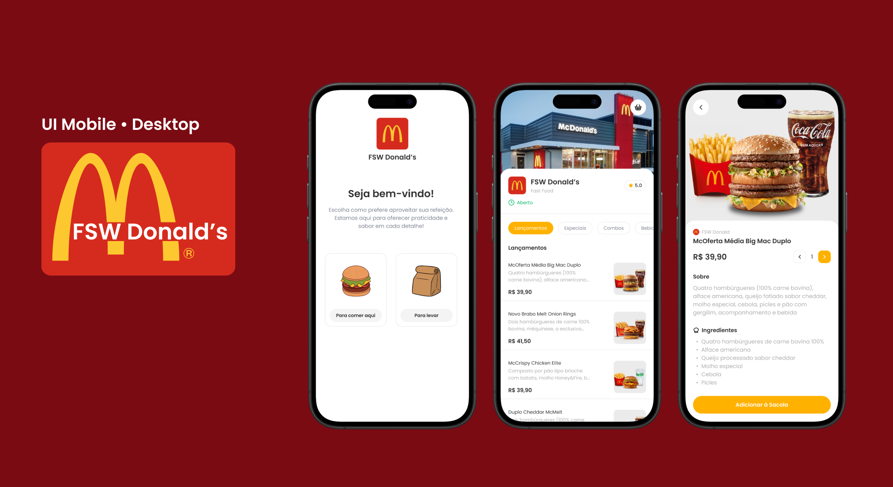

# 🍔 FSW Donald's

  

Aplicação fullstack de fast food inspirada na experiência do McDonald's, desenvolvida para praticar **Next.js, Prisma e integração com banco de dados**.  
O foco é oferecer uma interface moderna, responsiva e intuitiva, simulando um sistema de pedidos.

---

## 🚀 Tecnologias

---

## ⚙️ Funcionalidades

- Escolha entre **comer no local** ou **para viagem**
- Listagem de produtos com categorias (lançamentos, combos, bebidas…)
- Detalhes do produto com descrição e ingredientes
- Adicionar itens à sacola de pedidos
- Interface adaptada para Mobile (versão Desktop em desenvolvimento)

---

## 🌐 Acesse a aplicação

👉 [FSW Donald's - Deploy na Vercel](https://project-fastfood-ten.vercel.app/fsw-donalds)

---

## 📬 Contato

Lucas Sarasa  
  

